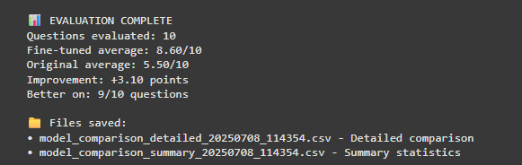

# Fine-tuning LLaMA 3.2 1B for SQL Generation

This project is about fine-tuning a small LLaMA model (1B) to generate SQL queries from natural language. I'm using a dataset that contains examples of how people ask questions and how those get translated into SQL.

## What I'm Doing

* I'm starting with a pre-trained LLaMA 3.2 1B model.
* I use a dataset called `synthetic_text_to_sql-ShareGPT` which has examples of prompts and the corresponding SQL queries.  
  Dataset URL: [https://huggingface.co/datasets/mlabonne/synthetic_text_to_sql-ShareGPT](https://huggingface.co/datasets/mlabonne/synthetic_text_to_sql-ShareGPT)
* I fine-tune the model using Unsloth libary with LoRA Adapters. This allows me to train only parts of the model, which makes it much faster and memory-efficient.

## Evaluation Process

The evaluation pipeline (see [`Evaluate_LLM.ipynb`](./Evaluate_LLM.ipynb)) works as follows:

1. **Question Generation**: 10 SQL questions are generated using Groq’s Gemma 2-9b-it model.
2. **Model Answering**: Both the original and fine-tuned LLaMA models answer all 10 questions.
3. **Scoring**: Each answer is evaluated and scored (1–10) by Groq’s Gemma 2-9b-it model.
4. **Results**: The average scores and feedback for both models are summarized and saved.

  <center></center>

  <br>

> **Note:** I usually use Gemini for evaluation, but yesterday Gemini was slow for some reason, so I used Groq instead. Groq is faster, but the questions and evaluation quality are not as good as Gemini. Even so, the fine-tuned model still performed very well.

## Why I’m Doing This

I want to build a model that can understand plain English and generate accurate SQL queries. This can be useful for tools where people want to ask questions about their data without writing SQL themselves.

I’m also doing this for fun and for learning—it’s an investment in my future skills.

## Where to Find the Model & Notebooks

You can find the fine-tuned model, including the .gguf file format for easy local use, on my Hugging Face repository:

👉 https://huggingface.co/Adhishtanaka/llama_3.2_1b_SQL/tree/main

You can also download and try the model directly using Ollama:

👉 https://ollama.com/adhishtanaka/llama_3.2_1b-SQL

To run it with Ollama, use:

```sh
ollama run adhishtanaka/llama_3.2_1b-SQL
```

You can find the Jupyter Notebook files used in this project directly in this repository:

- `Evaluate_LLM.ipynb`: The evaluation pipeline for the fine-tuned model.
- `Llama3.2_1B-SQL.ipynb`: The main notebook for fine-tuning and experimentation.

👉 Browse these files in the [GitHub repository](https://github.com/Adhishtanaka/llama3.2_1.b-SQL) for full code and documentation.


